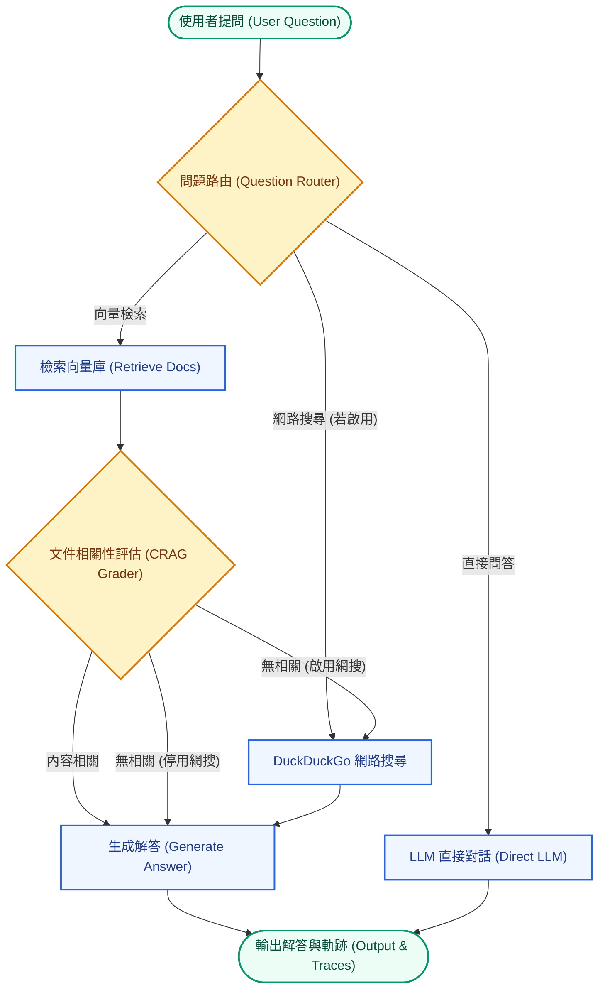

# LangGraph Adaptive & Corrective RAG (CRAG) Enterprise Document QA System

基於 **LangGraph** 與 **LangChain** 打造的 **商用級自適應與自我糾錯 RAG (Adaptive & Corrective RAG, CRAG)** 智能文件問答與企業知識庫管理系統。

本系統採用 **FastAPI 後端與 Streamlit 前端完全解耦架構**，支援 **Ollama (遠端/本地大模型)** 與 **Google Gemini** 雙模型提供者無縫切換。整合 **ChromaDB** 向量檢索、**DuckDuckGo** 即時網路搜尋備援、**JWT 身份驗證**、**帳號審核與暴力破解防護**，並提供 **統一使用者管理儀表板 (Unified Admin Dashboard)**。

---

## 系統核心亮點 (Key Features)

### 1. LangGraph 狀態圖驅動自適應工作流 (Adaptive RAG Graph)
* **Question Router**：智慧型問題路由分流，自動判斷走向「向量檢索 (VectorStore)」、「即時網路搜尋 (Web Search)」或「LLM 直接對話 (Direct LLM)」。
* **Document Relevance Grader (CRAG)**：LLM 動態評估檢索出的文件區塊相關性，自動過濾無用 context。
* **Web Search Fallback**：當向量資料庫欠缺資料或評估無相關時，可選擇觸發即時網路搜尋補強（支援開關控制，回答自動附帶「提示：本回覆已包含來自網路搜尋 (DuckDuckGo Search) 的即時資料」標籤）。
* **Execution Trace Logs**：完整記錄並於 UI 展現各節點 (Route, Grade, WebSearch, Generate) 的執行軌跡。

### 2. 企業級帳號權限與安全審核機制 (Security & Governance)
* **新帳號審核工作流 (Account Approval Workflow)**：新註冊帳號預設為 pending (待審核) 狀態，需經管理員核准後方可登入。
* **暴力破解防護 (Brute-Force Protection)**：5 分鐘內連續登入失敗 5 次自動鎖定帳號 15 分鐘。
* **每日提問配額管束 (Daily Quota Control)**：一般使用者每日限制提問 20 次（自動按日期重置），管理員享有無限提問額度。
* **.env 管理員自動配置 (Configurable Admin Users)**：支援在 .env 設定檔中指定初始管理員帳號與預設密碼 (例如 `ADMIN_USERS="admin, manager"` 與 `DEFAULT_ADMIN_PASSWORD="your_secure_password_here"`)。

### 3. 統一使用者管理儀表板 (Unified Admin Dashboard)
* **頂部導覽頁籤 (Top Page Navigation Tabs)**：劃分「RAG 智能問答」、「個人帳號設定」與「統一使用者管理面板 (Admin)」。
* **階層排序與統計指標**：用戶列表依據「管理員 (Admin) -> 待審核 (Pending) -> 一般用戶 (User)」精確排序，並提供全系統帳號數量動態指標。
* **多功能管理操作**：
  * 「核准」/「拒絕」：一鍵審核新註冊帳號。
  * 「升為管理員」/「降為一般用戶」：動態調整角色權限。
  * 「重置密碼」：彈出式視窗快速重置指定使用者密碼。
  * 「刪除帳號」：一鍵徹底清理帳號、登入紀錄及關聯配額資料。

### 4. 專屬專業視覺與知識庫操作 (Enterprise UI/UX)
* **平鋪式知識庫操作區**：於智能問答主頁面直接提供檔案上傳與切換區塊，支援一鍵建立向量索引與一鍵清空自訂文件與討論串。
* **企業級藍色科技主題 (Enterprise Royal Blue Design System)**：鎖定專屬亮色藍調主題與雙語標題風格（中文大標題 + 無外框英文副標題），搭配柔和氛圍微光背景與動態模型名稱標示。

---

## 系統工作流圖 (Workflow Diagram)



---

## 專案目錄結構 (Project Layout)

```text
langgraph_rag/
├── backend/                      # 後端獨立 REST API 服務
│   └── main.py                   # FastAPI 應用程式 (認證/配額/RAG/管理員 API)
├── frontend/                     # 前端獨立 UI 應用程式
│   └── app.py                    # 解耦 Streamlit 客戶端 UI (頂部導覽頁籤/管理員儀表板)
├── src/                          # 核心商業邏輯模組
│   ├── __init__.py
│   ├── config.py                 # 全域設定與環境變數解析 (解析 ADMIN_USERS)
│   ├── auth.py                   # 認證、JWT、SQLite (users.db)、密碼雜湊與配額管理
│   ├── providers.py              # LLM / Embeddings 提供者 (Ollama & Google Gemini)
│   ├── vectorstore.py            # 文件載入、切分與 Chroma 向量庫快取
│   └── graph/                    # LangGraph 狀態圖架構模組
│       ├── __init__.py
│       ├── state.py              # GraphState TypedDict 狀態定義
│       ├── nodes.py              # 各執行節點邏輯
│       ├── edges.py              # 條件分支動態路由邊
│       └── builder.py            # StateGraph 構建與編譯器
├── data/                         # 資料與用戶資料庫目錄 (users.db, uploads/)
├── .streamlit/                   # Streamlit 設定檔
│   └── config.toml               # 藍色系專業主題配置
├── Dockerfile.backend            # 後端 Docker 構建檔
├── Dockerfile.frontend           # 前端 Docker 構建檔
├── docker-compose.yml            # 容器編排檔
├── requirements.txt              # Python 套件依賴清單
├── .env.example                  # 環境變數範例檔
└── README.md                     # 專案說明文件
```

---

## 環境變數設定 (.env)

專案提供 [`.env.example`](file:///Users/Archer/Repos/langgraph_rag/.env.example) 範本檔。初次使用請建立 `.env` 檔案：

```bash
cp .env.example .env
```

**主要設定項目**：
* `LLM_PROVIDER`: 預設 LLM 提供者 (`"ollama"` 或 `"google"`)。
* `OLLAMA_BASE_URL` & `OLLAMA_MODEL`: Remote / 本地 Ollama 服務位址與模型名稱（預設：`https://api.ollama.com` / `gpt-oss:120b`）。
* `GOOGLE_API_KEY`: Google Gemini API 金鑰（當切換至 Gemini 時使用）。
* `JWT_SECRET_KEY`: JWT Token 簽名與密碼雜湊密鑰。
* `ADMIN_USERS`: 初始自動創建之管理員帳號（如 `ADMIN_USERS="admin, manager"` 或 `ADMIN_USERS="admin:admin123"`）。
* `DEFAULT_ADMIN_PASSWORD`: 管理員預設密碼。

---

## REST API 介面規格

| 分類 | HTTP 方法 | API 路徑 | 說明 |
| :--- | :--- | :--- | :--- |
| **認證** | `POST` | `/api/auth/register` | 使用者註冊（預設進入待審核狀態） |
| **認證** | `POST` | `/api/auth/login` | 使用者登入（取得 Bearer Token） |
| **使用者** | `GET` | `/api/user/me` | 查詢當前登入者資訊與每日配額 |
| **使用者** | `POST` | `/api/user/change-password` | 使用者自主變更個人密碼 |
| **RAG** | `POST` | `/api/rag/upload` | 上傳自訂 PDF/TXT/MD 文件並建置向量庫索引 |
| **RAG** | `POST` | `/api/rag/chat` | 執行 LangGraph RAG 問答工作流 |
| **管理員** | `GET` | `/api/admin/users/pending` | 取得待審核使用者列表 |
| **管理員** | `POST` | `/api/admin/users/review` | 核准或拒絕使用者帳號 |
| **管理員** | `GET` | `/api/users/all` | 取得系統全體使用者列表 |
| **管理員** | `POST` | `/api/admin/users/role` | 變更使用者角色 (`admin` / `user`) |
| **管理員** | `POST` | `/api/admin/users/reset-password` | 管理員重置指定使用者密碼 |
| **管理員** | `DELETE` | `/api/admin/users/{username}` | 刪除指定使用者帳號 |

---

## 本地開發與啟動步驟 (Local Development)

### 1. 安裝環境依賴

```bash
pip install -r requirements.txt
```

### 2. 啟動 FastAPI 後端服務

```bash
uvicorn backend.main:app --reload --port 8000
```
* 後端 API 服務位址：`http://localhost:8000`
* Swagger 互動式 API 文件：`http://localhost:8000/docs`

### 3. 啟動 Streamlit 前端介面

```bash
streamlit run frontend/app.py
```
* 前端系統網址：`http://localhost:8501`

---

## Docker 容器化布署 (Docker Compose Deployment)

```bash
# 1. 構建並啟動所有容器服務 (後端 FastAPI + 前端 Streamlit)
docker-compose up --build -d

# 2. 檢視容器運行狀態
docker-compose ps
```

* **前端介面 (Streamlit)**：`http://localhost:8501`
* **後端 API 服務 (FastAPI)**：`http://localhost:8000`
* **Swagger API 文件**：`http://localhost:8000/docs`
