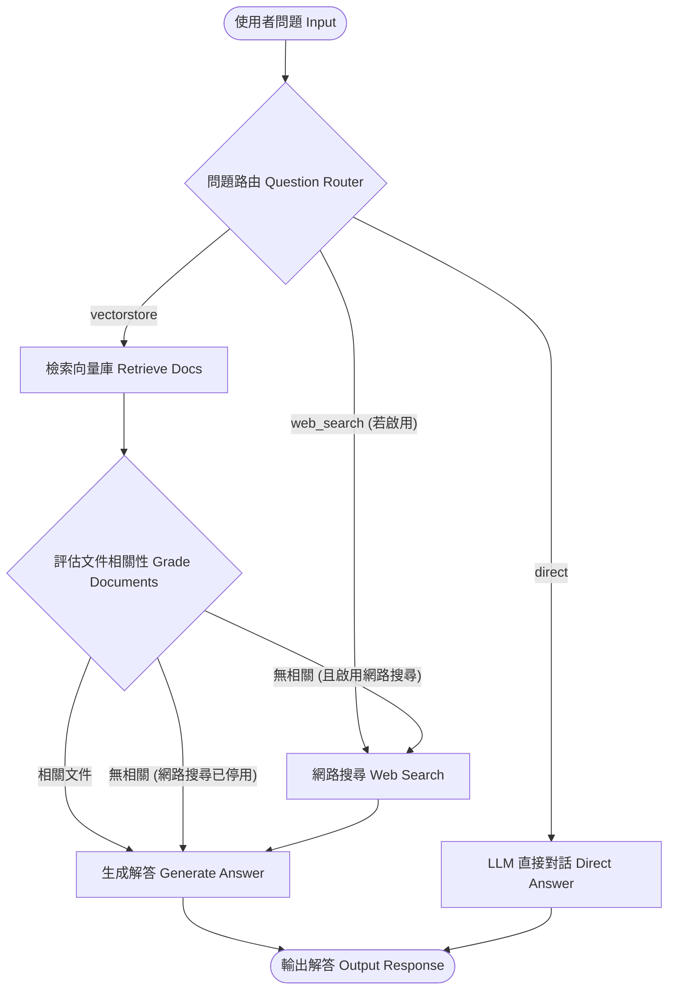

# LangGraph Adaptive & Corrective RAG (CRAG) Document QA System

一個基於 **LangGraph** 與 **LangChain** 打造的 **自適應與自我糾錯 RAG (Adaptive & Corrective RAG, CRAG)** 智能文件問答系統。支援 **Google Gemini** 與 **Ollama (本地/遠端伺服器)** 雙提供者切換，整合 **ChromaDB** 向量檢索與 **DuckDuckGo** 即時網路搜尋備援（可開關），提供 **CLI 終端介面** 與 **Streamlit 視覺化 Web 介面**。

---

## 系統亮點與架構 (Key Features)

* **LangGraph 狀態圖驅動 (StateGraph Workflow)**：
  * **Question Router**：智慧型問題分流，自動判斷走向向量檢索 (VectorStore)、即時搜尋 (Web Search) 或直接對話 (Direct LLM)。
  * **VectorStore Retrieval**：高效率本地 ChromaDB 向量檢索。
  * **Document Relevance Grader (CRAG)**：LLM 動態評估檢索出的文件區塊相關性，過濾無用 context。
  * **Web Search Fallback**：當向量資料庫欠缺資料或評估無相關時，自動觸發即時網路搜尋補強（支援開關設定）。
  * **Answer Generation & Traces**：生成解答並保留完整節點執行軌跡 (Trace Logs)。
* **多模型提供者 (Multi-Provider Support)**：
  * **Google Gemini API** (`gemini-3.6-flash` 等)。
  * **Ollama** 本地或 API Key 認證之遠端 LLM / Embedding 伺服器 (如 `qwen3:4b`, `nomic-embed-text`)。
* **可配置「即時網路搜尋」開關 (Real-Time Web Search Toggle)**：
  * 支援在 CLI 初始化選單或 Web UI 側邊欄隨時啟用/停用即時網路搜尋備援功能。
* **雙介面選擇**：
  * **CLI 終端互動 (`cli.py`)**：方便快速除錯與自動化測試。
  * **Streamlit Web 儀表板 (`app.py`)**：支援上傳自訂 PDF/TXT、開關網路搜尋、即時視覺化 LangGraph 執行軌跡與參考來源檢視。

---

## 系統工作流圖 (Workflow Diagram)



---

## 專案架構 (Project Layout)

```text
langgraph_rag/
├── src/                          # 核心套件模組 (Core Engine Package)
│   ├── __init__.py
│   ├── config.py                 # 全域設定與環境變數管理
│   ├── providers.py              # LLM / Embeddings 提供者 (Gemini & Ollama)
│   ├── vectorstore.py            # 文件載入、切分與 Chroma 向量庫封裝
│   └── graph/                    # LangGraph 狀態圖架構模組
│       ├── __init__.py
│       ├── state.py              # GraphState TypedDict 狀態定義
│       ├── nodes.py              # 執行節點 (Router, Retrieve, Grade, Web Search, Generate, Direct Answer)
│       ├── edges.py              # 條件分支動態路由邊 (Conditional Edges)
│       └── builder.py            # StateGraph 構建與編譯器
├── examples/                     # 基礎示範與傳統 RAG 範例
│   ├── 01_langchain_basics.py   # 基礎 LangChain 提示詞範例
│   └── 02_lcel_rag.py           # 傳統 LCEL RAG 範例
├── data/                         # 資料與測試文件目錄
│   └── Produktinformationsblatt.pdf # 範例 PDF 測試文件
├── app.py                        # Streamlit 視覺化 Web 主應用程式
├── cli.py                        # CLI 終端互動主程式
├── .env                          # 環境變數與模型設定
├── requirements.txt              # Python 套件依賴清單
└── README.md                     # 專案說明文件
```

---

## 環境需求與套件安裝

建議使用 Conda 虛擬環境 (`langgraph-rag-env`)：

```bash
# 建立與啟用 Conda 虛擬環境
conda create -n langgraph-rag-env python=3.11 -y
conda activate langgraph-rag-env

# 安裝所需套件
pip install -r requirements.txt
```

---

## 環境變數設定 (`.env`)

專案根目錄下的 `.env` 設定範例：

```env
# 提供者選擇: 'google' 或 'ollama'
LLM_PROVIDER="google"

# Google Gemini 設定
GOOGLE_API_KEY="YOUR_GOOGLE_API_KEY"
GOOGLE_MODEL="gemini-3.6-flash"
GOOGLE_EMBED_MODEL="models/gemini-embedding-001"

# Ollama 本地/自建伺服器設定
OLLAMA_BASE_URL="http://localhost:11434"
OLLAMA_API_KEY=""                # 選填：若遠端伺服器需 Bearer API Key 認證
OLLAMA_MODEL="qwen3:4b"          # 本地模型 (如 qwen3:4b, llama3.2)
OLLAMA_EMBED_MODEL="nomic-embed-text" # 本地 Embedding 模型
```

---

## 執行方式

### 1. 啟動 Streamlit Web 介面 (`app.py`)

```bash
streamlit run app.py
```

瀏覽器打開 `http://localhost:8501` 即可享受完整視覺化體驗：
* 上傳自訂 PDF / TXT / MD 文件。
* 隨時切換 Google Gemini 或 Ollama 模型。
* 自由勾選/取消勾選「即時網路搜尋 (Web Search)」。
* 即時顯示 LangGraph 執行節點軌跡 (Trace Logs)。
* 展開檢視向量庫或網路搜尋參考來源。

### 2. 啟動 CLI 終端互動模式 (`cli.py`)

```bash
python cli.py
```

1. 選擇模型提供者（Google Gemini / Ollama）。
2. 選擇是否開啟「即時網路搜尋」備援。
3. 開始問答，並於控制台即時觀察 LangGraph 狀態圖的轉移軌跡與解答。

### 3. 執行基礎/傳統 RAG 範例 (`examples/`)

```bash
python examples/01_langchain_basics.py
python examples/02_lcel_rag.py
```
